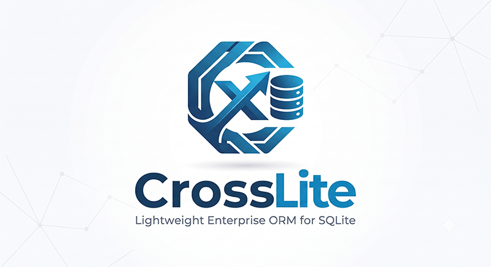

<p align="center">
  
</p>


### CrossLite

**CrossLite** is a lightweight, high-performance SQLite ORM for .NET 8 applications. It provides a clean, intuitive API for database operations with full CodeFirst support, LINQ queries, and advanced relationship management—all without the overhead of Entity Framework.

---

### Key Features

- ✅ **CodeFirst Database Design** – Define your schema using C# classes and attributes
- ✅ **Full LINQ Support** – Write type-safe queries using familiar LINQ syntax
- ✅ **Fluent Query Builder** – Construct complex SQL queries programmatically
- ✅ **Foreign Key Relationships** – Automatic relationship management with referential integrity
- ✅ **Lazy & Eager Loading** – Load related entities on-demand or preload with `Include()`/`ThenInclude()`
- ✅ **Identity Map Pattern** – Automatic entity caching and deduplication
- ✅ **Bulk Operations** – High-performance batch inserts, updates, and deletes
- ✅ **Transaction Support** – ACID-compliant transaction management
- ✅ **Schema Migrations** – Automatic table creation, migration, and recreation
- ✅ **Event-Driven Tracking** – Subscribe to entity lifecycle events
- ✅ **Composite Indexes** – Multi-column indexes and unique constraints
- ✅ **Dirty Tracking** – Automatic change detection for efficient updates

---

### Requirements

- **.NET 8.0** or higher
- **Castle.Core** 5.2.1
- **Microsoft.Data.Sqlite** 10.0.8

---

### Why CrossLite?

| Feature | CrossLite | Entity Framework Core |
|---------|-----------|----------------------|
| **Size** | Lightweight (~200KB) | Heavy (~10MB+) |
| **Performance** | Optimized for SQLite | Generic, slower |
| **CodeFirst** | ✅ Full support | ✅ Full support |
| **LINQ** | ✅ Expression trees | ✅ Full LINQ |
| **Identity Map** | ✅ Built-in | ✅ Built-in |
| **Lazy Loading** | ✅ Native | ⚠️ Requires proxies |
| **Bulk Operations** | ✅ Native | ⚠️ Extension required |
| **Learning Curve** | Low | Moderate |
| **SQLite-Specific** | ✅ Optimized | ❌ Generic |

---

### Table of Contents

- [Installation](#installation)
- [Quick Start](#quick-start)
- [Defining Entities](#defining-entities)
- [Creating Your Context](#creating-your-context)
- [Basic CRUD Operations](#basic-crud-operations)
- [Querying with LINQ](#querying-with-linq)
- [Foreign Keys & Relationships](#foreign-keys--relationships)
- [Lazy vs Eager Loading](#lazy-vs-eager-loading)
- [Fluent Query Builder](#fluent-query-builder)
- [Bulk Operations](#bulk-operations)
- [Transactions](#transactions)
- [CodeFirst Features](#codefirst-features)
- [Advanced Attributes](#advanced-attributes)
- [Identity Map & Caching](#identity-map--caching)
- [Performance Tips](#performance-tips)

---

### Installation

```bash
dotnet add package CrossLite
```

Or via NuGet Package Manager:

```
Install-Package CrossLite
```

---

### Quick Start

```csharp
using CrossLite;
using CrossLite.CodeFirst;
using Microsoft.Data.Sqlite;

// Define your entity
[Table]
public class User : EntityBase
{
    [Column, PrimaryKey, AutoIncrement]
    public virtual int Id { get; set; }

    [Column, Required]
    public virtual string Username { get; set; }

    [Column]
    public virtual string Email { get; set; }
}

// Create your context
public class AppContext : SQLiteContext
{
    public DbSet<User> Users { get; set; }

    public AppContext(string connectionString) : base(connectionString)
    {
        Users = new DbSet<User>(this);
    }
}

// Use it
var builder = new SqliteConnectionStringBuilder { DataSource = "myapp.db" };
using (var context = new AppContext(builder.ToString()))
{
    context.Connect();
    
    // Create table
    context.CreateTable<User>();
    
    // Insert
    var user = context.Users.Create();
    user.Username = "john_doe";
    user.Email = "john@example.com";
    context.Users.Add(user);
    
    // Query
    var users = context.Users.Where(u => u.Username.Contains("john")).ToList();
}
```

---

### Defining Entities

All entities must inherit from `EntityBase` and use the `[Table]` attribute. Properties mapped to database columns must be marked `virtual` for change tracking via Castle Core.

```csharp
using CrossLite;
using CrossLite.CodeFirst;

[Table]
public class Product : EntityBase
{
    [Column, PrimaryKey, AutoIncrement]
    public virtual int Id { get; set; }

    [Column, Required, Unique]
    public virtual string SKU { get; set; }

    [Column, Required]
    public virtual string Name { get; set; }

    [Column, Default(0)]
    public virtual decimal Price { get; set; }

    [Column]
    public virtual int CategoryId { get; set; }

    // Foreign key navigation
    [ForeignKey(nameof(CategoryId))]
    [References(nameof(Category.Id), OnDelete = ReferentialAction.Cascade)]
    public virtual Category Category { get; set; }
}

[Table]
public class Category : EntityBase
{
    [Column, PrimaryKey, AutoIncrement]
    public virtual int Id { get; set; }

    [Column, Required]
    public virtual string Name { get; set; }

    // Inverse relationship (lazy-loaded collection)
    public virtual EntitySet<Product> Products { get; set; }
}
```

---

### Creating Your Context

Derive from `SQLiteContext` and define your `DbSet<T>` properties:

```csharp
public class MyAppContext : SQLiteContext
{
    public DbSet<Product> Products { get; set; }
    public DbSet<Category> Categories { get; set; }
    public DbSet<Order> Orders { get; set; }

    public MyAppContext(string connectionString) : base(connectionString)
    {
        Products = new DbSet<Product>(this);
        Categories = new DbSet<Category>(this);
        Orders = new DbSet<Order>(this);
    }
}
```

---

### Basic CRUD Operations

#### **Create**

**Why use `.Create()`?**

Using `context.DbSet.Create()` is the recommended approach because it enables **entity tracking via the EntityInterceptor**. This ensures that:
- Property changes are automatically detected (dirty tracking)
- Foreign key navigation properties are lazy-loaded correctly
- Child `EntitySet<T>` collections work as expected
- The entity participates in the context's identity map

##### **Method 1: Create + Manual Add (Two-Step)**

```csharp
// ✅ Recommended: Full entity tracking and relationship support
var product = context.Products.Create();
product.Name = "Laptop";
product.Price = 999.99m;
product.CategoryId = 1;
context.Products.Add(product);

// After insertion, you can access child collections
foreach (var review in product.Reviews)  // EntitySet works correctly
{
    Console.WriteLine(review.Comment);
}
```

##### **Method 2: Create with Initializer (One-Step)**

The `Create(Action<TEntity>)` overload combines entity creation, initialization, and database insertion into a **single fluent call**:

```csharp
// ✅ Fluent one-liner: Create, initialize, and persist in one step
var product = context.Products.Create(p =>
{
    p.Name = "Laptop";
    p.Price = 999.99m;
    p.CategoryId = 1;
});

// Entity is already persisted and tracked
Console.WriteLine($"Product ID: {product.Id}"); // Auto-generated ID is available

// All tracking features work immediately
foreach (var review in product.Reviews)
{
    Console.WriteLine(review.Comment);
}
```

**When to use `Create(x => ...)`:**

| Scenario | Benefit |
|----------|---------|
| Single entity insertion | Cleaner, more concise code |
| Inline object initialization | Reduces boilerplate |
| Fluent API style | Chainable, readable syntax |
| Immediate persistence needed | No need to call `.Add()` separately |

**Example: Bulk Creation with Initializer**

```csharp
// Create multiple entities fluently
var products = new[]
{
    context.Products.Create(p => { p.Name = "Laptop"; p.Price = 999.99m; }),
    context.Products.Create(p => { p.Name = "Mouse"; p.Price = 29.99m; }),
    context.Products.Create(p => { p.Name = "Keyboard"; p.Price = 79.99m; })
};

// All entities are already persisted and tracked
Console.WriteLine($"Created {products.Length} products");
```

**Example: Creating Related Entities**

```csharp
// Create a category and immediately use its ID
var category = context.Categories.Create(c =>
{
    c.Name = "Electronics";
    c.Description = "Electronic devices and accessories";
});

// Use the auto-generated ID immediately
var product = context.Products.Create(p =>
{
    p.Name = "Laptop";
    p.Price = 999.99m;
    p.CategoryId = category.Id;  // ID is already available
});

// Navigate the relationship
Console.WriteLine($"{product.Name} is in {product.Category.Name}");
```

---

**Alternative: Using `new` for Insert-Only Operations**

If you only need to insert data and don't require entity tracking, you can use the `new` keyword. However, **this approach has limitations**:

- ❌ No automatic dirty tracking
- ❌ Foreign key navigation properties won't lazy-load
- ❌ Child `EntitySet<T>` collections will **not work**
- ❌ Entity won't be cached in the identity map

```csharp
// ⚠️ Insert-only: No tracking, no relationships
var product = new Product
{
    Name = "Laptop",
    Price = 999.99m,
    CategoryId = 1
};
context.Products.Add(product);

// ❌ This will fail or return empty because the entity isn't tracked
foreach (var review in product.Reviews)  // Won't work!
{
    Console.WriteLine(review.Comment);
}
```

---

**Comparison Table**

| Approach | Code Lines | Tracked? | Auto-Persisted? | Use Case |
|----------|-----------|----------|-----------------|----------|
| `.Create()` + `.Add()` | 5+ | ✅ Yes | ❌ Manual | Multi-step initialization, conditional logic |
| `.Create(x => ...)` | 1-4 | ✅ Yes | ✅ Automatic | Fluent, inline creation |
| `new` + `.Add()` | 4+ | ❌ No | ❌ Manual | Bulk imports, no relationships needed |

---

**Best Practice:** 

- Use `.Create(x => ...)` for **single entity creation** with simple initialization
- Use `.Create()` + `.Add()` when you need **conditional logic** or **multi-step setup** before persistence
- Use `new` only for **high-performance bulk imports** where tracking isn't needed

---

### Key Differences Summary

```csharp
// Traditional approach (2 steps)
var product1 = context.Products.Create();
product1.Name = "Laptop";
context.Products.Add(product1);

// Fluent approach (1 step) - SAME RESULT
var product2 = context.Products.Create(p => p.Name = "Laptop");

// Both are tracked, both are persisted, both support relationships
```

The `Create(Action<TEntity>)` method is simply a **convenience wrapper** that reduces boilerplate while maintaining all the benefits of entity tracking.

#### **Read**

CrossLite provides multiple ways to query entities, from simple primary key lookups to complex LINQ queries.

##### **Find by Primary Key**

```csharp
// Single primary key
var product = context.Products.Find(1);

// Composite primary key (ordered)
var assignment = context.Assignments.Find(soldierId, positionId);
```

##### **Find by Predicate**

```csharp
// Find first match
var product = context.Products.Find(p => p.SKU == "LAP-001");

// Returns null if not found
if (product == null)
{
    Console.WriteLine("Product not found");
}
```

##### **FindAll - Multiple Results**

The `FindAll()` method has several overloads for different query scenarios:

```csharp
// 1. Find all by LINQ predicate (most common)
var expensiveProducts = context.Products.FindAll(p => p.Price > 500);

// 2. Find all by partial composite key (ordered)
// Useful for finding all entities matching the first N keys of a composite key
var employeeAssignments = context.Assignments.FindAll(employeeId);

// 3. Find all by dictionary (flexible key matching)
var keyValues = new Dictionary<string, object>
{
    { "CategoryId", 1 },
    { "IsActive", true }
};
var products = context.Products.FindAll(keyValues);

// 4. Find all using WhereStatement (advanced)
var where = new WhereStatement(context);
where.And("Price", Comparison.GreaterThan, 100);
where.And("Stock", Comparison.LessThan, 10);
var lowStockProducts = context.Products.FindAll(where);
```

##### **Get All Entities**

```csharp
// Get all (use with caution on large tables)
var allProducts = context.Products.ToList();

// Better: Use Where() for filtering
var activeProducts = context.Products
    .Where(p => p.IsActive)
    .ToList();
```

##### **Check Existence**

```csharp
// Check if any entities exist
bool hasProducts = context.Products.Any();

// Check if specific entities exist
bool hasExpensive = context.Products.Any(p => p.Price > 1000);
```

##### **Count Entities**

```csharp
// Count all
int totalProducts = context.Products.Count;

// Count with condition
int expensiveCount = context.Products.CountWhere(p => p.Price > 500);
```

---

#### **Update**

##### **Update Single Entity**

```csharp
var product = context.Products.Find(1);
product.Price = 899.99m;
product.Stock = 50;
context.Products.Update(product);
```

##### **Update Multiple Entities**

```csharp
var products = context.Products
    .Where(p => p.CategoryId == 1)
    .ToList();

foreach (var product in products)
{
    product.Price *= 1.1m; // 10% price increase
}

context.Products.UpdateRange(products);
```

##### **Bulk Update (UpdateWhere)**

For high-performance updates without loading entities into memory:

```csharp
// Update all products in a category
int updated = context.Products.UpdateWhere(
    p => p.CategoryId == 1,
    builder => builder.Set("Price", 99.99m)
);

Console.WriteLine($"{updated} products updated");

// Update with calculations
context.Products.UpdateWhere(
    p => p.Stock < 10,
    builder => builder
        .Set("IsLowStock", true)
        .Set("ReorderDate", DateTime.Now)
);

// Using WhereStatement for complex conditions
var where = new WhereStatement(context);
where.And("Price", Comparison.GreaterThan, 100);
where.And("Stock", Comparison.Equals, 0);

context.Products.UpdateWhere(
    where,
    builder => builder.Set("IsAvailable", false)
);
```

**Performance Note:** `UpdateWhere()` executes a single SQL UPDATE statement and doesn't load entities into memory, making it ideal for bulk operations.

---

#### **Delete**

##### **Delete Single Entity**

```csharp
var product = context.Products.Find(1);
context.Products.Remove(product);
```

##### **Delete Multiple Entities**

```csharp
var obsoleteProducts = context.Products
    .Where(p => p.Discontinued)
    .ToList();

context.Products.RemoveRange(obsoleteProducts);
```

##### **Bulk Delete (RemoveWhere)**

For high-performance deletes without loading entities into memory:

```csharp
// Delete all products below a price threshold
int deleted = context.Products.RemoveWhere(p => p.Price < 5);
Console.WriteLine($"{deleted} products deleted");

// Delete with complex conditions
deleted = context.Products.RemoveWhere(
    p => p.Stock == 0 && p.Discontinued
);

// Using WhereStatement for advanced queries
var where = new WhereStatement(context);
where.And("LastSoldDate", Comparison.LessThan, DateTime.Now.AddYears(-2));
where.And("Stock", Comparison.Equals, 0);

deleted = context.Products.RemoveWhere(where);
```

**Performance Note:** `RemoveWhere()` executes a single SQL DELETE statement and doesn't load entities into memory, making it ideal for bulk deletions.

**Important:** Both `UpdateWhere()` and `RemoveWhere()` automatically clear the identity map cache for the affected entity type to prevent stale data.

---

#### **Summary of Query Methods**

| Method | Use Case | Returns | Loads Entities? |
|--------|----------|---------|-----------------|
| `Find(id)` | Single entity by primary key | `TEntity` or `null` | ✅ Yes |
| `Find(predicate)` | First match by condition | `TEntity` or `null` | ✅ Yes |
| `FindAll(predicate)` | All matches by condition | `List<TEntity>` | ✅ Yes |
| `Where(predicate)` | LINQ query (deferred) | `DbQuery<TEntity>` | ⏱️ Deferred |
| `Any()` / `Any(predicate)` | Check existence | `bool` | ❌ No |
| `CountWhere(predicate)` | Count matches | `int` | ❌ No |
| `UpdateWhere(predicate, ...)` | Bulk update | `int` (rows affected) | ❌ No |
| `RemoveWhere(predicate)` | Bulk delete | `int` (rows affected) | ❌ No |

**Performance Tip:** Use `UpdateWhere()` and `RemoveWhere()` for bulk operations instead of loading entities into memory when you don't need to access navigation properties or trigger entity events.

---

### Querying with LINQ

CrossLite supports standard LINQ queries with full expression tree translation:

```csharp
// Where clause
var expensiveProducts = context.Products
    .Where(p => p.Price > 500)
    .ToList();

// OrderBy
var sortedProducts = context.Products
    .OrderBy(p => p.Name)
    .ThenByDescending(p => p.Price)
    .ToList();

// Skip/Take (pagination)
var page2 = context.Products
    .OrderBy(p => p.Id)
    .Skip(20)
    .Take(10)
    .ToList();

// Any/Count
bool hasExpensive = context.Products.Any(p => p.Price > 1000);
int count = context.Products.CountWhere(p => p.CategoryId == 1);

// First/FirstOrDefault
var firstProduct = context.Products
    .Where(p => p.CategoryId == 1)
    .FirstOrDefault();

// Select projection
var productNames = context.Products
    .Select(p => new { p.Id, p.Name })
    .ToList();
```

---

### Foreign Keys & Relationships

#### **One-to-Many Relationship**

```csharp
[Table]
public class Author : EntityBase
{
    [Column, PrimaryKey, AutoIncrement]
    public virtual int Id { get; set; }

    [Column, Required]
    public virtual string Name { get; set; }

    // Lazy-loaded collection of books
    public virtual EntitySet<Book> Books { get; set; }
}

[Table]
public class Book : EntityBase
{
    [Column, PrimaryKey, AutoIncrement]
    public virtual int Id { get; set; }

    [Column, Required]
    public virtual string Title { get; set; }

    [Column, Required]
    public virtual int AuthorId { get; set; }

    // Foreign key navigation
    [ForeignKey(nameof(AuthorId))]
    [References(nameof(Author.Id), OnDelete = ReferentialAction.Cascade)]
    public virtual Author Author { get; set; }
}
```

#### **Referential Integrity Options**

```csharp
[References(nameof(Parent.Id), 
    OnDelete = ReferentialAction.Cascade,   // Delete children when parent is deleted
    OnUpdate = ReferentialAction.Cascade)]  // Update children when parent key changes

// Available actions:
// - ReferentialAction.Cascade
// - ReferentialAction.Restrict
// - ReferentialAction.SetNull
// - ReferentialAction.SetDefault
// - ReferentialAction.NoAction
```

---

### Lazy vs Eager Loading

#### **Lazy Loading (Default)**

Related entities are loaded on-demand when accessed:

```csharp
var book = context.Books.Find(1);
// Author is loaded when accessed
string authorName = book.Author.Name;

// EntitySet collections are also lazy-loaded
var author = context.Authors.Find(1);
foreach (var book in author.Books)  // Query executed here
{
    Console.WriteLine(book.Title);
}
```

#### **Eager Loading with Include()**

Preload related entities to avoid N+1 queries:

```csharp
// Single level include
var books = context.Books
    .Where(b => b.Price > 20)
    .Include(b => b.Author)
    .ToList();

// Multi-level nested includes
var orders = context.Orders
    .Include(o => o.Customer)
        .ThenInclude(c => c.Address)
    .Include(o => o.OrderItems)
        .ThenInclude(i => i.Product)
    .ToList();

// Multiple sibling includes
var products = context.Products
    .Include(p => p.Category)
    .Include(p => p.Supplier)
    .ToList();
```

---

### Fluent Query Builder

For complex queries, use the fluent QueryBuilder API:

```csharp
using CrossLite.QueryBuilder;

// Complex SELECT with JOINs
var query = context.From<Product>()
    .SelectAll()
    .InnerJoin("Category")
        .On("Product.CategoryId", "Category.Id")
    .Where("Product.Price").GreaterThan(100)
    .And("Category.Name").Equals("Electronics")
    .OrderBy("Product.Name", Sorting.Ascending)
    .Take(50);

var results = query.ExecuteQuery<Product>();

// Aggregates
var avgPrice = context.From<Product>()
    .SelectAverage("Price", "AvgPrice")
    .Where("CategoryId").Equals(1)
    .ExecuteScalar<decimal>();

// GROUP BY with HAVING
var categoryCounts = context.From<Product>()
    .Select("CategoryId")
    .SelectCount("*", "ProductCount")
    .GroupBy("CategoryId")
    .Having("ProductCount", Comparison.GreaterThan, 10)
    .ExecuteQuery();
```

---

### Bulk Operations

Optimize performance with bulk operations:

```csharp
// Bulk Insert
var products = new List<Product>
{
    new Product { Name = "Item 1", Price = 10 },
    new Product { Name = "Item 2", Price = 20 },
    new Product { Name = "Item 3", Price = 30 }
};
context.Products.BulkInsert(products);

// Bulk Update
context.Products.UpdateWhere(
    p => p.CategoryId == 1,
    builder => builder.Set("Price", 0)
);

// Bulk Delete
int deleted = context.Products.RemoveWhere(p => p.Price < 5);
```

---

### Transactions

Ensure data consistency with transactions:

```csharp
using (var transaction = context.BeginTransaction())
{
    try
    {
        var product = context.Products.Find(1);
        product.Stock -= 1;
        context.Products.Update(product);

        var order = context.Orders.Create();
        order.ProductId = product.Id;
        context.Orders.Add(order);

        transaction.Commit();
    }
    catch
    {
        transaction.Rollback();
        throw;
    }
}
```

---

### CodeFirst Features

#### **Create Tables**

```csharp
context.CreateTable<Product>();
context.CreateTable<Category>();
```

#### **Drop Tables**

```csharp
context.DropTable<Product>();
```

#### **Migrate Tables**

Automatically adds missing columns without losing data:

```csharp
context.MigrateTable<Product>();
```

#### **Recreate Tables**

Drops and recreates the table (data loss):

```csharp
context.RecreateTable<Product>();
```

#### **Ensure Indexes**

Creates all indexes defined by attributes:

```csharp
context.EnsureIndexes<Product>();
```

---

### Advanced Attributes

#### **Composite Indexes**

```csharp
[Table]
[CompositeIndex("idx_name_category", nameof(Name), nameof(CategoryId))]
public class Product : EntityBase
{
    [Column, PrimaryKey]
    public virtual int Id { get; set; }

    [Column]
    public virtual string Name { get; set; }

    [Column]
    public virtual int CategoryId { get; set; }
}
```

#### **Composite Unique Constraints**

```csharp
[Table]
[CompositeUnique("uq_sku_supplier", nameof(SKU), nameof(SupplierId))]
public class Product : EntityBase
{
    [Column]
    public virtual string SKU { get; set; }

    [Column]
    public virtual int SupplierId { get; set; }
}
```

#### **Single Column Attributes**

```csharp
[Column, PrimaryKey, AutoIncrement]
public virtual int Id { get; set; }

[Column, Required]  // NOT NULL
public virtual string Name { get; set; }

[Column, Unique]  // UNIQUE constraint
public virtual string Email { get; set; }

[Column, Default(0)]  // DEFAULT value
public virtual int Status { get; set; }

[Column, Index]  // Create index
public virtual string SKU { get; set; }

[Column, Collation(Collation.NoCase)]  // Case-insensitive
public virtual string Username { get; set; }
```

---

### Identity Map & Caching

CrossLite uses an identity map to ensure each entity is loaded only once per context:

```csharp
var user1 = context.Users.Find(1);
var user2 = context.Users.Find(1);

// user1 and user2 reference the SAME object
Console.WriteLine(ReferenceEquals(user1, user2));  // True

// Preload entities into cache
context.Preload<User>();
context.Preload<User>(u => u.IsActive);

// Clear cache
context.ClearIdentityMap();
context.ClearIdentityMap(typeof(User));

// Detach entity from cache
context.Detach(user1);

// Check if cached
if (context.TryGetCached<User>(new object[] { 1 }, out var cachedUser))
{
    // Use cached entity
}
```

---

### Performance Tips

1. **Use Bulk Operations** – `BulkInsert()`, `BulkUpdate()`, and `BulkDelete()` are significantly faster than individual operations
2. **Eager Load Relationships** – Use `Include()` to avoid N+1 query problems
3. **Preload Frequently Used Entities** – Use `Preload<T>()` to cache entities at startup
4. **Use Transactions** – Batch multiple operations in a single transaction
5. **Dispose Contexts Properly** – Always use `using` statements to ensure connections are closed
6. **Index Your Queries** – Add `[Index]` or `[CompositeIndex]` attributes to frequently queried columns
7. **Use Projections** – Select only the columns you need with `.Select()`
8. **Vacuum Periodically** – Call `context.VacuumDatabase()` to reclaim space and optimize performance

---

### Raw SQL Support

When you need full control, execute raw SQL:

```csharp
// Execute non-query
int rowsAffected = context.Execute(
    "UPDATE Products SET Price = Price * 1.1 WHERE CategoryId = @P0", 
    categoryId
);

// Execute scalar
int count = context.ExecuteScalar<int>(
    "SELECT COUNT(*) FROM Products WHERE Price > @P0", 
    100
);

// Execute query
var results = context.Query<Product>(
    "SELECT * FROM Products WHERE CategoryId = @P0 ORDER BY Price DESC", 
    categoryId
);
```

---

### Event-Driven Entity Tracking

Subscribe to entity lifecycle events:

```csharp
context.Products.EntityAdded += (product) => 
{
    Console.WriteLine($"Product added: {product.Name}");
};

context.Products.EntityUpdated += (product) => 
{
    Console.WriteLine($"Product updated: {product.Name}");
};

context.Products.EntityRemoved += (product) => 
{
    Console.WriteLine($"Product removed: {product.Name}");
};

// Bulk events
context.Products.EntitiesAdded += (products) => 
{
    Console.WriteLine($"{products.Count()} products added");
};
```

---

### Database Maintenance

```csharp
// Integrity check
int errors = context.PerformIntegrityCheck();

// Vacuum database (reclaim space and optimize)
context.VacuumDatabase();

// Check connection status
bool isOpen = context.IsConnected();

// Manual connection management
context.Connect();
context.Close();
```

---

### License

CrossLite is open source. Check the repository for license details.

---

### Contributing

Contributions are welcome! Please submit issues and pull requests on GitHub.

---

### Support

For questions, issues, or feature requests, please open an issue on the GitHub repository.